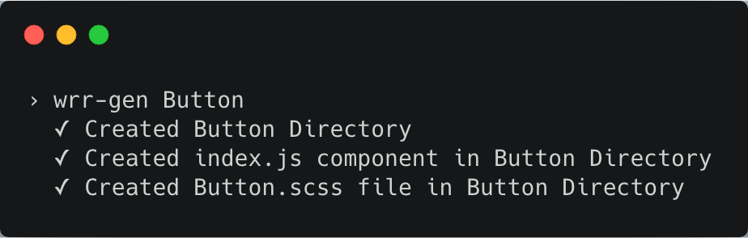

# NYC Parks Component Generator

A command line tool that uses a hard-coded React component template to generate:

- a component folder
- a scss file
- a functional component file following single element format with
  - PropTypes setup
  - css modules and classnames setup
  - accepting children and classNames props from parent, spreading ...props

## Installation

### Global Install

`npm install wrr-gen -g`

## Usage

- In your terminal, navigate to the folder under which you want to add the component folder, e.g. /components/generic/
- On the command line, type `wrr-gen` and hit enter.
- respond to the prompt with your component name e.g. Button
- Alternately, you can just put your component name in the command and it will immediately create the files/folder: `wrr-gen MyComponentName`
- open in your editor and develop

## Examples

### Interactive Prompt (no name argument)

### Name Argument (immediate creation of files/folders)

